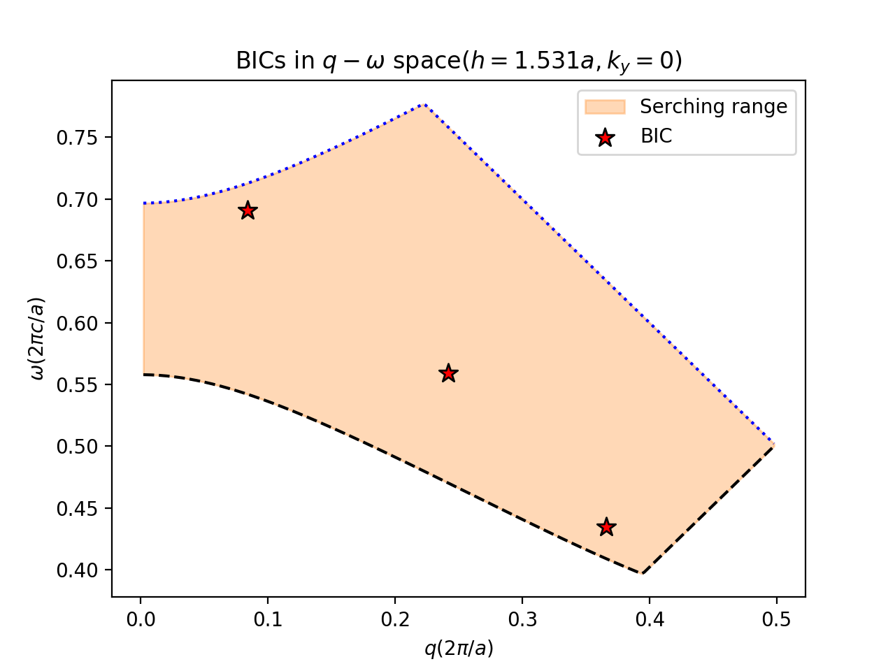
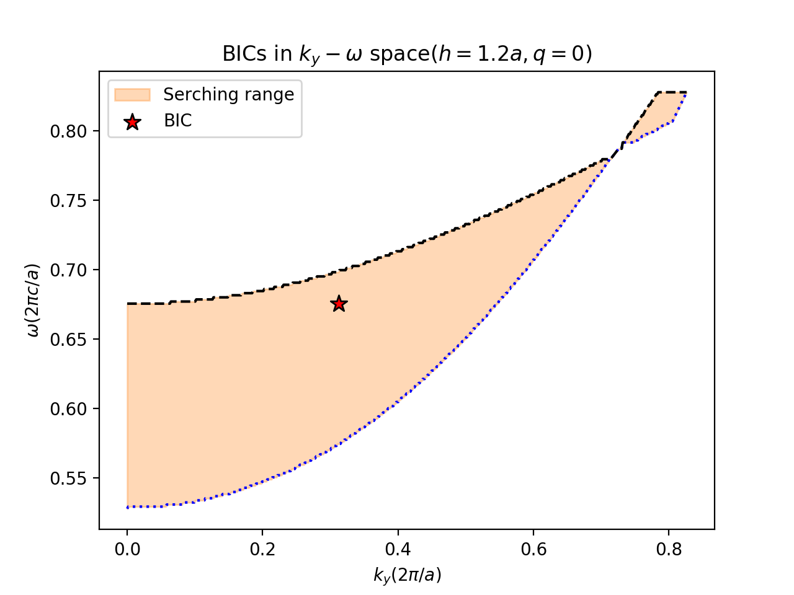

BICKS is a solver to find BICs in 1D PhC slab. Give the properties of a PhC slab and you can get the BICs. 

# Output  

BICKS can find BICs in the both high direction lines. 

In the periodical direction:



and in the other direction:



# Install

Easiest way:

```bash
pip install bicks
```

Try this in your terminal or git bash to install bicks :

```bash
git clone https://github.com/PMRG-LE707/bicks.git
```

# Example

There are a lot examples in ``` ./docs/examples/``` which can help you quick-start.

# Documentation

See [here](https://bicksdoc.readthedocs.io/en/latest/) to get help about classes and functions in bicks.


 

